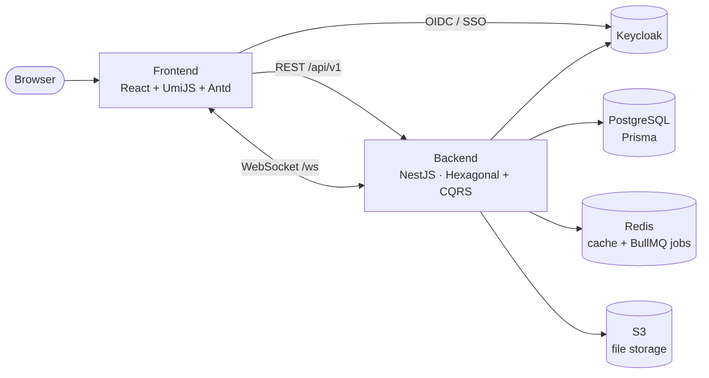

<div align="center">

# CampusGig

A Fiverr‑style **gig marketplace scoped to a university** — students **hire** peers and **sell** their own skills, with an escrow wallet and admin moderation keeping every deal safe. One account is both buyer and seller.

This is the **umbrella repository**: it bundles the two deployable projects as Git submodules so the whole system lives behind a single link.

[](https://github.com/StoriuSs/campusgig-frontend)
[](https://github.com/StoriuSs/campusgig-backend)
[](https://www.keycloak.org/)
[](https://socket.io/)

</div>

---

## Repository structure

This repo contains no application code of its own — it references each project at a specific commit via submodules.

| Submodule | What it is | Stack |
|---|---|---|
| [`campusgig-frontend`](https://github.com/StoriuSs/campusgig-frontend) | Single‑page web client (public / buyer / seller / admin) | React 17 · UmiJS 3.5 · Ant Design 4.21 · TypeScript · Keycloak · Socket.IO |
| [`campusgig-backend`](https://github.com/StoriuSs/campusgig-backend) | API & real‑time backend | NestJS 10 (Hexagonal + CQRS) · Prisma 7 · PostgreSQL 16 · Redis 7 + BullMQ · Keycloak 26 · Socket.IO · S3 |

```
campusgig/
├── .gitmodules            # submodule definitions
├── campusgig-frontend/    # → github.com/StoriuSs/campusgig-frontend (pinned commit)
└── campusgig-backend/     # → github.com/StoriuSs/campusgig-backend  (pinned commit)
```

Each submodule has its own README with full setup, environment, and deployment instructions.

---

## Getting started

Clone **with submodules** so both projects come down too:

```bash
git clone --recurse-submodules https://github.com/StoriuSs/campusgig.git
cd campusgig
```

Already cloned without the flag? Pull the submodules in:

```bash
git submodule update --init --recursive
```

Then follow each project's own README to run it locally:

- **Backend** — [campusgig-backend/README.md](campusgig-backend/README.md) (Docker: `pnpm docker:dev` → API on `http://localhost:8888`)
- **Frontend** — [campusgig-frontend/README.md](campusgig-frontend/README.md) (`yarn dev` → app on `http://localhost:3001`)

> Start the backend (and its Postgres / Redis / Keycloak) first; the frontend reads the API and Keycloak URLs from its env at build time.

---

## Architecture at a glance



- The frontend talks to the backend over a versioned REST API (`/api/v1`) and a Socket.IO `/ws` channel for live messaging, notifications, and presence.
- Authentication is centralized in **Keycloak** (single sign‑on, role‑based: buyer / seller / admin).
- The backend follows **hexagonal architecture + CQRS**; money movements run inside row‑locked transactions, and order/dispute deadlines are driven by scheduled **BullMQ** jobs.

---

## What it does

- **Gigs** — sellers create gigs (4‑step flow); admins approve/reject; browse & search with filters (price, rating, delivery time, endorsed‑only) and sorts.
- **Orders & escrow** — a full order state machine with an escrow wallet; funds are held and released on completion, with a 20% platform fee.
- **Disputes** — either party can file with evidence + chat history; an admin resolves with one of three verdicts (refund buyer / complete for seller / split funds).
- **Wallet** — deposits, escrow holds, earnings, and admin‑approved withdrawals (simulated payments in v1 — no real gateway).
- **Reviews & ratings**, **real‑time messaging & notifications** (in‑app + email), and an **Endorsed** trust badge.
- **Admin suite** — gig queue, disputes, withdrawals, user endorsement, categories, a metrics dashboard, Excel reports, and an activity log.
- **Bilingual UI** — English / Tiếng Việt.

---

## Live deployment

| Surface | URL |
|---|---|
| Web app | https://campusgig.tech |
| API | https://api.campusgig.tech |
| Auth (Keycloak) | https://auth.campusgig.tech |

Both projects deploy independently from their own repos (single VPS, Docker Compose, Nginx + Cloudflare). This umbrella repo is for bundling and overview — it does not deploy anything itself.

---

## Working with the submodules

A submodule is pinned to a **specific commit**, not a live branch. To update after changing code:

```bash
# 1. commit & push inside the submodule
cd campusgig-backend
git add -A && git commit -m "…" && git push

# 2. move the pointer in this umbrella repo
cd ..
git add campusgig-backend
git commit -m "Bump backend" && git push
```

Pulling the umbrella repo does not auto‑update the submodule working trees — run `git submodule update --init --recursive` after a pull, or set it once with:

```bash
git config --global submodule.recurse true
```
